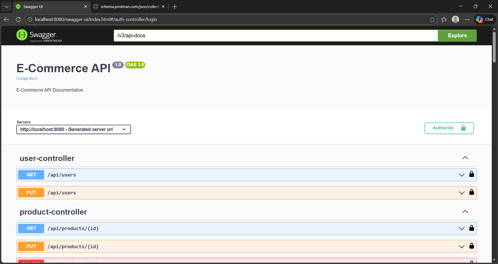
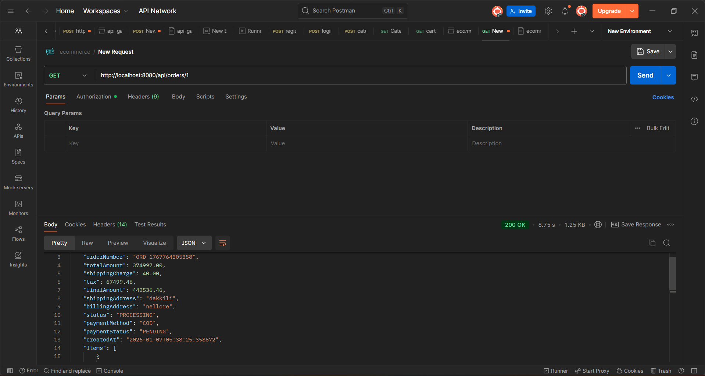

# 🛒 E-Commerce Platform

A **RESTful E-Commerce application** built with **Spring Boot**, **PostgreSQL**, and **JWT authentication**.  
This project provides a backend for handling users, products, and orders, with secure APIs and Docker support.

---

## 📌 Project Overview

- **Backend:** Java, Spring Boot 3.3.2
- **Database:** PostgreSQL 14
- **Authentication:** JWT-based security
- **Containerization:** Docker & Docker Compose
- **API Documentation:** OpenAPI / Swagger & Postman
- **Testing:** Postman collection included

### Features

- User Registration & Login with JWT
- Role-based access (USER / ADMIN)
- Product management (CRUD)
- Order management (CRUD)
- Secure endpoints with JWT
- Detailed API documentation

---

## 🏗️ Project Structure

```text
ecommerce-backend/
├── src/main/java/com/ecommerce/
│ ├── config/ - Spring configuration classes
│ ├── controller/ - REST controllers
│ ├── service/ - Business logic services
│ ├── repository/ - Spring Data JPA interfaces
│ ├── entity/ - JPA entities
│ ├── dto/ - Data transfer objects
│ ├── security/ - Security configuration
│ └── exception/ - Custom exceptions
├── src/main/resources/
│ ├── application.properties - Main config
│ ├── data.sql - Initial data
│ └── schema.sql - Database schema
├── src/test/ - Test classes
├── Dockerfile - Docker configuration
├── docker-compose.yml - Docker configuration
└── postman/ - API test collection
└── docs/ - API documentation
```
---
## ⚙️ Prerequisites

- Java 21
- Maven 3.x
- Docker & Docker Compose
- PostgreSQL (optional if using Docker)

---

## 🚀 Setup & Run

### 1️⃣ Clone the repository
```bash
git clone https://github.com/parasusamba/DevelopersArena_2
cd ecommerce
```

### 2️⃣ Setup environment variables

Create a .env file based on .env.example:

```
DB_USERNAME=postgres
DB_PASSWORD=postgres
DB_NAME=ecommerce_db
JWT_SECRET=YourJWTSecretKey
JWT_EXPIRATION=86400000
SERVER_PORT=8080
```

### 3️⃣ Run using Docker Compose
```bash
# Using Docker
docker compose up --build
```

## 🛠️ Technologies Used 
1. Java 21

2. Spring Boot 3.3.2

3. Spring Security & JWT

4. PostgreSQL 14

5. Docker & Docker Compose

6. Maven

## Database Schema :
### Tables :
```
users - User accounts

products - Product catalog

categories - Product categories

carts - Shopping carts

cart_items - Cart items

orders - Customer orders

order_items - Order items
```
### Schema Relations :
```text
users (1) ── (1) carts (1) ── (n) cart_items (n) ── (1) products
   │                                         │
   │                                         │
   └─ (n) orders (1) ── (n) order_items ─────┘
                            │
categories (1) ─────────────┘
```

## Monitoring :
### Actuator Endpoints :
```text
Health: GET /api/actuator/health

Metrics: GET /api/actuator/metrics

Info: GET /api/actuator/info
```
### Logs :
1. location: console
2. Level: INFO (DEBUG for development)

## Sample Workflow :
```text
Register new user → Get JWT token

Browse products → GET /api/products

Add to cart → POST /api/cart/add

View cart → GET /api/cart

Create order → POST /api/orders

Track order → GET /api/orders/{id}
```
## Flow of Control: 
```text
Client Request → Security Filter → Controller → Service → Repository → Database
       ↑              ↓              ↓           ↓           ↓           ↓
Client Response ← Exception Handler ← Logging Aspect ← Business Logic ← Data Access
```
## 📚 API Documentation Summary:
```text
check at /docs for more detatails...
```
#### Swagger UI: ```texthttp://localhost:8080/swagger-ui.html```
### Authentication:
```text

POST /api/auth/register - Register new user

POST /api/auth/login - Login and get JWT token
```

### Products:

```text
GET /api/products - List all products (paginated)

GET /api/products/{id} - Get product by ID

POST /api/products - Create product (Admin only)

PUT /api/products/{id} - Update product (Admin only)

DELETE /api/products/{id} - Delete product (Admin only)

GET /api/products/search - Search products

GET /api/products/category/{id} - Get products by category
```
### Categories:
```text
GET /api/categories - List all categories

GET /api/categories/{id} - Get category by ID

POST /api/categories - Create category (Admin only)

PUT /api/categories/{id} - Update category (Admin only)

DELETE /api/categories/{id} - Delete category (Admin only)
```
### User:
```text
GET /api/users/profile - Get user profile

PUT /api/users/profile - Update user profile
```
### Cart:
```text
POST /api/cart/add - Add item to cart

GET /api/cart - Get cart

PUT /api/cart/items/{id} - Update cart item

DELETE /api/cart/items/{id} - Remove cart item

DELETE /api/cart/clear - Clear cart
```
### Orders:
```text
POST /api/orders - Create order

GET /api/orders/{id} - Get order details

GET /api/orders - Get user orders (paginated)

PUT /api/orders/{id}/status - Update order status (Admin only)
```
## Swagger UI Preview:


## Postman UI Preview:



## 🤝 Contribution

Contributions are welcome!  
Feel free to fork this repository and submit a pull request.

---

## 📜 License

This project is licensed under the **MIT License**.  
See the [LICENSE](LICENSE) file for details.

---

## 👤 Author

**Your Name**
- GitHub: https://github.com/parasusamba
- LinkedIn: https://linkedin.com/in/samba-parasu  

